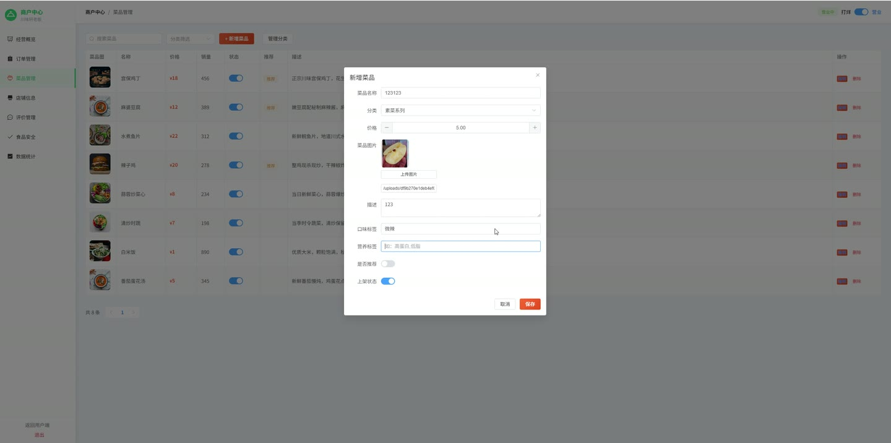
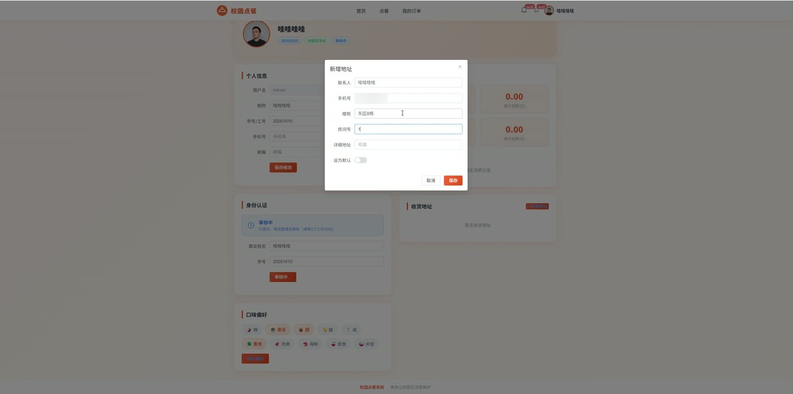
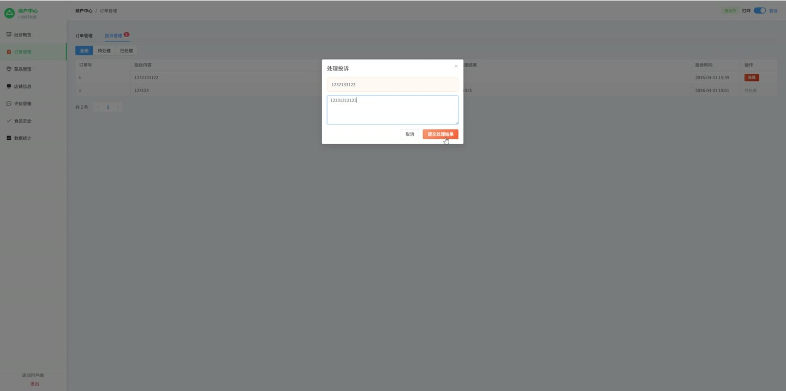

# (附文档)Springboot3+Vue3+MySQL 校园点餐系统

**技术栈**：Springboot3、Vue3、MySQL

### 系统简介

本系统为基于 SpringBoot3 + Vue3 + MySQL 构建的校园点餐平台，采用前后端分离架构，支持普通用户、商家（食堂店铺）、管理员三种角色。用户可浏览食堂与菜品、加入购物车并下单，商家可管理店铺、菜品、订单及评价，管理员负责用户审核、食堂/店铺/通知/轮播图等全局配置，并提供实时客流与经营数据统计。
 
### 核心功能
 
### 普通用户端

 
- 浏览食堂列表（按排序展示）、查看食堂详情（名称、位置、楼层、营业时间） 
- 查看某食堂下所有营业中的店铺（名称、描述、评分、销量、公告） 
- 浏览店铺内菜品列表（支持按分类筛选、按关键词搜索、按销量排序） 
- 查看菜品详情（名称、价格、图片、描述、口味、营养标签） 
- 将菜品加入购物车（选择数量、备注），支持同一菜品累加数量 
- 查看购物车列表（菜品名、图片、单价、数量、备注），修改数量或清空指定店铺的购物车 
- 提交订单（选择收货地址、填写备注），下单前需完成身份认证（提交真实姓名与学号） 
- 查看个人订单列表（按状态筛选），查看订单详情（菜品明细、总价、状态） 
- 取消待处理或制作中的订单（状态为 0 或 1 时允许取消） 
- 对已完成订单进行评价（评分、文字内容、图片），商家可回复评价 
- 管理收货地址（新增/编辑/删除，支持设置默认地址） 
- 查看个人消费统计（总订单数、总金额、本月订单数、本月金额、最近10笔订单） 
- 查看系统通知列表（取餐提醒、投诉处理结果），标记全部已读 
- 提交投诉（关联店铺与订单），查看投诉处理结果 
- 更新个人资料（昵称、头像、手机号、口味偏好） 
- 查看首页轮播图（按排序展示启用的轮播） 
- 查看系统公告（最新10条，按时间倒序） 
- 查看推荐菜品（isRecommend=1 的菜品，按销量降序取前12条） 
- 查看各食堂实时客流（最新记录，含人数与拥堵等级 LOW/MEDIUM/HIGH）
 
### 商家端

 
- 查看并编辑自己店铺信息（名称、描述、公告、营业时间、图片、起送价） 
- 切换店铺营业状态（开业/打烊） 
- 管理菜品分类（新增/编辑/删除，按排序展示） 
- 管理菜品（新增/编辑/删除，支持按分类筛选、关键词搜索） 
- 上架/下架菜品（修改菜品状态） 
- 查看本店订单列表（按状态筛选，按时间倒序） 
- 查看订单详情（订单信息 + 菜品明细列表） 
- 更新订单状态（接单、制作完成、配送/取餐完成等），制作完成时自动发送取餐通知给用户 
- 查看本店评价列表（按时间倒序），回复用户评价 
- 查看本店投诉列表（按状态筛选），处理投诉并填写处理结果，处理完成后通知用户 
- 查看经营概览（总订单数、今日订单数、待处理订单数、总收入） 
- 查看近30天每日订单数与营收趋势 
- 查看近12个月每月订单数与营收趋势 
- 查看菜品销量排行（Top 10，含销量与营收） 
- 查看订单状态分布统计（各状态订单数量） 
- 管理食材安全记录（新增、查看食材名称、供应商、产地、批号、生产/过期日期、证书）
 
### 管理员端

 
- 查看用户列表（支持按用户名/昵称搜索、按角色筛选），新增/编辑/删除用户 
- 启用或禁用用户账号（修改用户状态） 
- 审核用户身份认证（查看待审核列表，通过或拒绝并填写拒绝原因） 
- 查看商家入驻申请（状态为待审核/已拒绝的商家），审核通过或拒绝 
- 为已通过的商家创建店铺（指定店铺名称与所属食堂） 
- 管理食堂（新增/编辑食堂名称、位置、楼层、图片、营业时间、排序） 
- 管理店铺（查看店铺列表，启用/禁用店铺，删除店铺） 
- 管理轮播图（新增/编辑/删除，设置标题、图片链接、排序、启用状态） 
- 管理系统公告（新增/编辑/删除，设置标题、内容、类型、启用状态） 
- 查看系统概览统计（总用户数、总店铺数、总订单数、今日订单数、上架菜品数、待审核认证数） 
- 查看实时运营数据（今日订单数、近1小时订单数、今日营收、待处理订单数、制作中订单数） 
- 查看各食堂实时客流（最新记录，含人数与等级） 
- 手动更新食堂客流数据（输入人数，自动判定 LOW/MEDIUM/HIGH 等级） 
- 查看所有食材安全记录（按时间倒序）
 
### 技术栈

 后端框架Spring Boot 3.x ORMMyBatis-Plus（含分页插件） 权限认证JWT（HS256 算法，自定义拦截器） 密码加密BCryptPasswordEncoder 前端框架Vue 3 状态管理Vuex / Pinia（由 Vue3 项目决定） 构建工具Vite 数据库MySQL（逻辑删除，自动填充 createTime/updateTime） 文件上传MultipartFile 本地存储（配置 upload.path） 工具类Hutool（雪花ID生成）
 
### 交付内容

 
- 后端完整源码 
- 前端完整源码 
- 数据库初始化脚本 
- 万字文档

## 界面展示

---

## 获取完整源码 + 万字文档

本仓库为项目介绍页。**完整前后端源码、数据库初始化脚本、万字项目文档**，请加微信 `kangkangcode`，或访问 [codekk.top](http://codekk.top) 获取。

可作课程设计 / 毕业设计参考，支持远程部署调试。